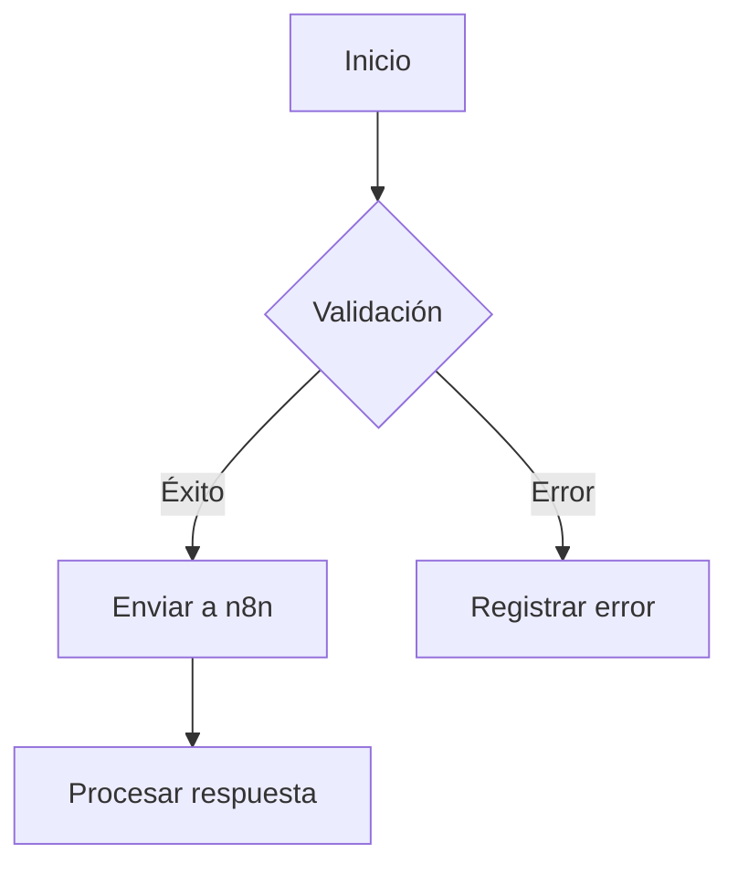

# Esquema de Integración n8n

## Endpoints principales
- `POST /v1/ordenes`: Creación de órdenes
- `GET /v1/ordenes/{id}`: Consulta de estado

## Esquema de payload
```json
{
  "id": "string",
  "items": [
    {
      "producto_id": "string",
      "cantidad": "integer"
    }
  ]
}
```

## Códigos de error
- 1001: Error de autenticación
- 1002: Límite de tasa excedido
- 1003: Tiempo de espera agotado

## Diagrama de flujo
